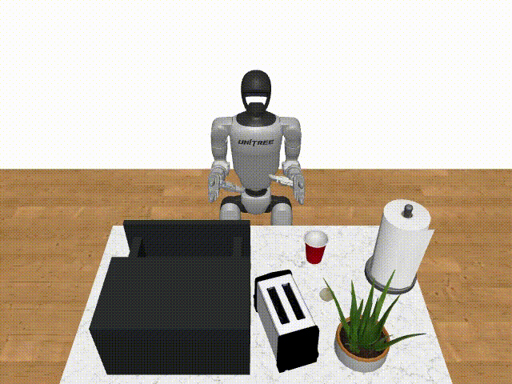

# GR00T-G1

**GR00T-G1** is an adaptation of NVIDIA's [Isaac GR00T](https://github.com/NVIDIA/Isaac-GR00T) project for the **Unitree G1 humanoid robot**.
This repository modifies the original GR00T framework to integrate G1's kinematics, dynamics, and control interface for simulation and potential real-world deployment.

### Sim Env: [robocasa-g1-tabletop-tasks](https://github.com/hogunkee/robocasa_g1)

For Simulation Evaluation, please refer to [robocasa-g1-tabletop-tasks](https://github.com/hogunkee/robocasa_g1)

---

## Overview

GR00T-G1 enables:
- Simulation of Unitree G1 in Robocasa and Robosuite with GR00T’s learning & control framework
- Compatibility with G1’s URDF and mesh models
- Motion retargetting to control G1 with the GR00T-N1.5.

---

## Key Changes from Original GR00T
- Adjusted control API for G1 joint naming & limits
- Updated motion policies to match G1's DoF and body proportions
- Added example configs for G1 manipulation tasks

